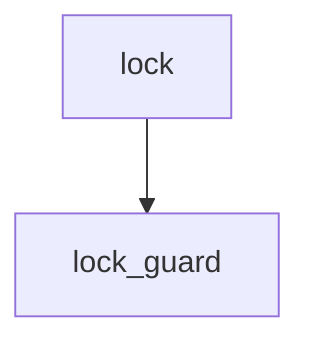

## TODO
>should contain key words below

promise 

async

future 

join

future_status

shared_future 

packaged_task 

mutex

thread 

launch

unique_lock 

## 学习路线

### thread

#### mutex

```mermaid
graph TD;
   lock --> lock_guard
```

