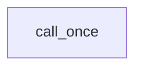

## TODO
>should contain key words below

promise 

async

future 

join

future_status

shared_future 

packaged_task 

thread 

launch

unique_lock 

## 学习路线

### thread

### evolution

> Tag: `scoped block` `RAII`

#### mutex

```mermaid
graph TD;

   mutex --> lock
   
   %% Tries to lock the mutex. Returns immediately. On successful lock acquisition returns true, otherwise returns false.
   lock --> try_lock
   
   %% Blocks until specified timeout_duration has elapsed or the lock is acquired, whichever comes first. On successful lock acquisition returns true, otherwise returns false.
   try_lock --> try_lock_for  %% 类似 setTimeout
   %% If timeout_duration is less or equal timeout_duration.zero(), the function behaves like try_lock().
   
   %% Tries to lock the mutex. Blocks until specified timeout_time has been reached or the lock is acquired, whichever comes first. On successful lock acquisition returns true, otherwise returns false.
   try_lock --> try_lock_until
   %% If timeout_time has already passed, this function behaves like try_lock().

   
   %% RAII；scoped block；防止 mutex 因中途break而未被释放
   lock --> lock_guard
   mutex --> lock_guard
   
   %% 单线程重复进入mutex避免死锁；保护 shared data 单线程 exclusive
   mutex --> recursive_mutex
%%    lock_guard --> recursive_mutex 
   
   %% timed_mutex provides the ability to attempt to claim ownership of a timed_mutex with a timeout via the try_lock_for() and try_lock_until() methods.
   mutex --> timed_mutex
   
   timed_mutex --> try_lock_for
   timed_mutex --> try_lock_until
   
   %% Separates the thread of execution from the thread object, allowing execution to continue independently. Any allocated resources will be freed once the thread exits. After calling detach *this no longer owns any thread.
   thread --> detach
   
   %% Checks if the std::thread object identifies an active thread of execution. Specifically, returns true if get_id() != std::thread::id(). So a default constructed thread is not joinable. A thread that has finished executing code, but has not yet been joined is still considered an active thread of execution and is therefore joinable.
   thread --> joinable  %% 没有被detach或join
   
   thread --> join
   
 
```




